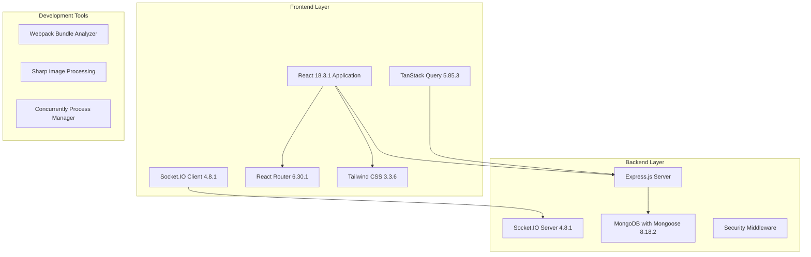

# Alibobo-Old Codebase Analysis - Design Document

## Overview

This document provides a comprehensive technical design for analyzing the alibobo-old codebase. The analysis will systematically examine all components, services, and architectural patterns to create a complete understanding of the system's structure, functionality, and implementation details. This analysis directly supports migration planning, performance optimization, security assessment, and feature parity evaluation as specified in the requirements.

## Architecture Analysis Framework

### System Architecture Overview



### Component Analysis Strategy

#### 1. Frontend Component Hierarchy Analysis

**Component Categories:**
- **Core Components**: Main application structure and routing
- **UI Components**: Reusable interface elements
- **Business Components**: Feature-specific components
- **Admin Components**: Administrative interface components
- **Utility Components**: Helper and optimization components

**Analysis Approach:**
```
1. Map component dependencies and relationships
2. Identify component props and state patterns
3. Document component lifecycle and performance optimizations
4. Analyze custom hooks integration
5. Evaluate component reusability and maintainability
```

#### 2. Backend Service Architecture Analysis

**Service Categories:**
- **API Routes**: RESTful endpoint implementations
- **Controllers**: Business logic handlers
- **Models**: Data structure definitions
- **Middleware**: Request processing layers
- **Services**: Utility and business services
- **Scripts**: Database and maintenance utilities

**Analysis Framework:**
```
1. Document API endpoint structure and functionality
2. Analyze data flow and business logic patterns
3. Evaluate database schema and relationships
4. Assess security implementations
5. Review performance optimization strategies
```

## Technology Stack Analysis

### Frontend Technology Stack

#### Core Technologies
```yaml
React: 18.3.1
  - Modern hooks and concurrent features
  - Error boundaries implementation
  - Performance optimizations

TanStack Query: 5.85.3
  - Server state management
  - Caching strategies
  - Background updates
  - Optimistic updates

Socket.IO Client: 4.8.1
  - Real-time communication
  - Event-driven architecture
  - Connection management

React Router: 6.30.1
  - Client-side routing
  - Nested routes
  - Route protection

Tailwind CSS: 3.3.6
  - Utility-first styling
  - Custom design system
  - Responsive design
```

#### Development Dependencies
```yaml
Build Tools:
  - Webpack Bundle Analyzer: 4.10.2
  - Sharp: 0.33.4 (Image processing)
  - PostCSS: 8.4.32
  - Autoprefixer: 10.4.16

Development Utilities:
  - Concurrently: 9.2.1
  - Cross-env: 10.0.0
  - HTTP Proxy Middleware: 3.0.5
```

### Backend Technology Stack

#### Core Technologies
```yaml
Express.js: 4.18.2
  - RESTful API framework
  - Middleware architecture
  - Route handling

Mongoose: 8.18.2
  - MongoDB ODM
  - Schema validation
  - Query optimization

Socket.IO: 4.8.1
  - Real-time communication
  - Room management
  - Event broadcasting

Security Stack:
  - Helmet: 8.1.0 (Security headers)
  - CORS: 2.8.5 (Cross-origin requests)
  - Express Rate Limit: 8.0.1 (API protection)
  - Express Mongo Sanitize: 2.2.0 (Injection prevention)
```

#### Utility Libraries
```yaml
File Processing:
  - Multer: 2.0.2 (File uploads)
  - UUID: 13.0.0 (Unique identifiers)

Performance:
  - Compression: 1.8.1 (Response compression)
  - HPP: 0.2.3 (HTTP Parameter Pollution protection)

Environment:
  - Dotenv: 16.3.1 (Environment variables)
  - Cross-env: 10.0.0 (Cross-platform environment)
```

## Component Architecture Design

### Frontend Component Structure

#### Core Application Components
```
App.js (Root Component)
├── Router Configuration
├── Global Providers
│   ├── TanStack Query Provider
│   ├── Socket.IO Provider
│   └── Error Boundary Provider
└── Route Components
    ├── Public Routes
    │   ├── MainPage
    │   ├── ProductDetail
    │   └── Catalog
    └── Admin Routes
        ├── AdminDashboard
        ├── AdminProducts
        ├── AdminOrders
        └── AdminCraftsmen
```

#### Component Analysis Framework
```typescript
interface ComponentAnalysis {
  name: string;
  type: 'functional' | 'class';
  hooks: string[];
  props: PropDefinition[];
  state: StateDefinition[];
  dependencies: string[];
  performance: PerformanceMetrics;
  testing: TestCoverage;
}

interface PropDefinition {
  name: string;
  type: string;
  required: boolean;
  defaultValue?: any;
}

interface StateDefinition {
  name: string;
  type: string;
  initialValue: any;
  updaters: string[];
}
```

### Custom Hooks Architecture

#### Hook Categories
```yaml
Data Management Hooks:
  - useProductQueries: Product data fetching
  - useProductsFast: Optimized product queries
  - useUltraFastProducts: Ultra-optimized loading
  - useOrderQueries: Order management
  - useCraftsmanQueries: Craftsman data
  - useStatistics: Analytics data

Real-time Hooks:
  - useRealTimeStock: Live stock updates
  - useGlobalStock: Global stock state
  - useRealNotifications: Real-time notifications
  - useRecentActivities: Activity tracking

Utility Hooks:
  - useDebounce: Input debouncing
  - useFuzzySearch: Search functionality
  - useOptimizedFetch: API optimization
  - useIntelligentPreloading: Smart preloading
```

#### Hook Analysis Pattern
```typescript
interface HookAnalysis {
  name: string;
  purpose: string;
  dependencies: string[];
  returnValue: any;
  sideEffects: string[];
  performance: {
    memoization: boolean;
    debouncing: boolean;
    caching: boolean;
  };
  usage: ComponentUsage[];
}
```

## Backend Architecture Design

### API Layer Structure

#### Route Organization
```
/api/
├── products/
│   ├── GET /api/products (List products)
│   ├── GET /api/products/:id (Get product)
│   ├── POST /api/products (Create product)
│   ├── PUT /api/products/:id (Update product)
│   └── DELETE /api/products/:id (Delete product)
├── products/fast/
│   ├── GET /api/products/fast (Optimized listing)
│   └── GET /api/products/fast/:id (Optimized single)
├── craftsmen/
│   ├── GET /api/craftsmen (List craftsmen)
│   ├── GET /api/craftsmen/:id (Get craftsman)
│   └── POST /api/craftsmen (Create craftsman)
├── orders/
│   ├── GET /api/orders (List orders)
│   ├── POST /api/orders (Create order)
│   └── PUT /api/orders/:id (Update order)
├── notifications/
│   ├── GET /api/notifications (Get notifications)
│   └── POST /api/notifications (Create notification)
└── statistics/
    ├── GET /api/statistics/overview (General stats)
    └── GET /api/statistics/products (Product stats)
```

#### Controller Architecture
```typescript
interface ControllerAnalysis {
  name: string;
  routes: RouteDefinition[];
  middleware: string[];
  errorHandling: ErrorHandlingPattern[];
  validation: ValidationRules[];
  performance: {
    caching: boolean;
    optimization: string[];
    rateLimit: RateLimitConfig;
  };
}

interface RouteDefinition {
  method: 'GET' | 'POST' | 'PUT' | 'DELETE';
  path: string;
  handler: string;
  middleware: string[];
  validation: ValidationSchema;
}
```

### Database Schema Analysis

#### Model Structure Analysis
```typescript
interface ModelAnalysis {
  name: string;
  collection: string;
  schema: SchemaDefinition;
  indexes: IndexDefinition[];
  relationships: RelationshipDefinition[];
  validation: ValidationRules[];
  middleware: MongooseMiddleware[];
}

interface SchemaDefinition {
  fields: FieldDefinition[];
  options: SchemaOptions;
}

interface FieldDefinition {
  name: string;
  type: string;
  required: boolean;
  indexed: boolean;
  unique: boolean;
  default?: any;
  validation?: ValidationRule[];
}
```

#### Key Models to Analyze
```yaml
Product Model:
  - Basic product information
  - Variant management
  - Image handling (base64 and file paths)
  - SEO fields
  - Stock management
  - Category and tagging

Craftsman Model:
  - Personal information
  - Skills and specialties
  - Portfolio management
  - Rating system
  - Availability tracking

Order Model:
  - Customer information
  - Order items and quantities
  - Status tracking
  - Payment information
  - Shipping details

Notification Model:
  - Message content
  - Recipient targeting
  - Priority levels
  - Read status tracking

Recent Activity Model:
  - Action tracking
  - User information
  - Resource references
  - Metadata storage
```

## Performance Analysis Framework

### Frontend Performance Metrics

#### Component Performance Analysis
```typescript
interface ComponentPerformance {
  renderTime: number;
  reRenderCount: number;
  memoryUsage: number;
  bundleSize: number;
  lazyLoading: boolean;
  memoization: MemoizationStrategy[];
  optimizations: OptimizationTechnique[];
}

interface OptimizationTechnique {
  type: 'memo' | 'useMemo' | 'useCallback' | 'lazy' | 'virtualization';
  implementation: string;
  impact: 'high' | 'medium' | 'low';
}
```

#### Loading Performance Analysis
```yaml
Code Splitting:
  - Route-based splitting
  - Component-based splitting
  - Dynamic imports

Image Optimization:
  - Lazy loading implementation
  - WebP format support
  - Progressive loading
  - Responsive images

Caching Strategies:
  - TanStack Query caching
  - Browser caching
  - Service worker caching
  - LocalStorage usage
```

### Backend Performance Metrics

#### Database Performance Analysis
```typescript
interface DatabasePerformance {
  queryTime: number;
  indexUsage: IndexUsageStats[];
  connectionPool: ConnectionPoolStats;
  caching: CachingStrategy[];
  optimization: QueryOptimization[];
}

interface QueryOptimization {
  type: 'projection' | 'aggregation' | 'indexing' | 'batching';
  implementation: string;
  performance_impact: number;
}
```

#### API Performance Analysis
```yaml
Response Time Optimization:
  - Micro-caching implementation
  - Query optimization
  - Projection usage
  - Aggregation pipelines

Security Performance:
  - Rate limiting impact
  - Sanitization overhead
  - Helmet header processing
  - CORS handling

Compression and Caching:
  - Response compression
  - Static asset caching
  - API response caching
```

## Real-time Architecture Analysis

### Socket.IO Implementation Analysis

#### Client-Side Real-time Features
```typescript
interface SocketClientAnalysis {
  connections: ConnectionConfig[];
  events: EventDefinition[];
  rooms: RoomManagement[];
  errorHandling: ErrorHandlingStrategy[];
  reconnection: ReconnectionStrategy;
}

interface EventDefinition {
  name: string;
  direction: 'emit' | 'listen';
  payload: PayloadSchema;
  handler: string;
  frequency: 'high' | 'medium' | 'low';
}
```

#### Server-Side Real-time Features
```yaml
Stock Updates:
  - Real-time stock synchronization
  - Cross-client updates
  - Inventory management
  - Stock alerts

Notifications:
  - Push notification system
  - User targeting
  - Priority handling
  - Delivery confirmation

Activity Tracking:
  - User activity monitoring
  - Admin activity feeds
  - System event logging
  - Real-time dashboards
```

## Security Analysis Framework

### Security Implementation Analysis

#### Frontend Security
```typescript
interface FrontendSecurity {
  xssProtection: XSSProtectionMeasures[];
  csrfProtection: CSRFProtectionMeasures[];
  dataValidation: ValidationRules[];
  secureStorage: StorageSecurityMeasures[];
  apiSecurity: APISecurityMeasures[];
}
```

#### Backend Security
```yaml
Network Security:
  - HTTPS enforcement
  - CORS configuration
  - Security headers (Helmet)
  - Rate limiting

Input Security:
  - MongoDB injection prevention
  - Input sanitization
  - Parameter pollution protection
  - Request validation

Authentication & Authorization:
  - Session management
  - Access control
  - Role-based permissions
  - API key management
```

## Development Tools Analysis

### Build and Development Tools

#### Frontend Development Tools
```yaml
Build Tools:
  - React Scripts: 5.0.1
  - Webpack Bundle Analyzer: 4.10.2
  - PostCSS: 8.4.32
  - Tailwind CSS: 3.3.6

Development Utilities:
  - Concurrently: 9.2.1 (Process management)
  - Cross-env: 10.0.0 (Environment variables)
  - HTTP Proxy Middleware: 3.0.5 (Development proxy)

Image Processing:
  - Sharp: 0.33.4 (Image optimization)
  - PNG to ICO: 2.1.8 (Favicon generation)
```

#### Backend Development Tools
```yaml
Development:
  - Nodemon: 3.0.1 (Auto-restart)
  - Cross-env: 10.0.0 (Environment management)

Database Tools:
  - MongoDB optimization scripts
  - Index creation utilities
  - Data migration tools
  - Performance monitoring
```

## Analysis Methodology

### Code Analysis Process

#### 1. Static Code Analysis
```yaml
File Structure Analysis:
  - Directory organization
  - File naming conventions
  - Import/export patterns
  - Dependency relationships

Code Quality Analysis:
  - ESLint configuration
  - Code formatting standards
  - Error handling patterns
  - Performance optimizations
  - Technical debt identification
  - Code duplication detection
  - Inconsistent pattern identification
```

#### 2. Dynamic Analysis
```yaml
Runtime Analysis:
  - Component lifecycle tracking
  - Performance monitoring
  - Memory usage analysis
  - Network request patterns

User Flow Analysis:
  - Navigation patterns
  - State management flow
  - Data fetching strategies
  - Error handling flows
  - Feature functionality mapping
```

#### 3. Architecture Pattern Analysis
```yaml
Design Patterns:
  - Component composition patterns
  - State management patterns
  - API design patterns
  - Database access patterns

Anti-patterns:
  - Code duplication
  - Tight coupling
  - Performance bottlenecks
  - Security vulnerabilities

Testing Analysis:
  - Test coverage assessment
  - Testing strategy documentation
  - Test quality evaluation
```

#### 4. Feature Mapping Analysis
```yaml
User-Facing Features:
  - Product catalog functionality
  - Search and filtering capabilities
  - Order management features
  - User interface components

Admin Features:
  - Administrative panel capabilities
  - Content management features
  - User management functionality
  - System configuration options

API Functionality:
  - Endpoint purpose documentation
  - Request/response patterns
  - Authentication mechanisms
  - Data validation rules
```

## Documentation Strategy

### Analysis Documentation Structure

#### 1. Component Documentation
```typescript
interface ComponentDocumentation {
  overview: string;
  purpose: string;
  props: PropDocumentation[];
  usage: UsageExample[];
  dependencies: DependencyList[];
  performance: PerformanceNotes[];
  testing: TestingNotes[];
}
```

#### 2. API Documentation
```typescript
interface APIDocumentation {
  endpoint: string;
  method: string;
  description: string;
  parameters: ParameterDocumentation[];
  responses: ResponseDocumentation[];
  examples: APIExample[];
  security: SecurityRequirements[];
}
```

#### 3. Architecture Documentation
```yaml
System Overview:
  - High-level architecture diagrams
  - Component relationship maps
  - Data flow diagrams
  - Security architecture

Technical Details:
  - Technology stack analysis
  - Performance optimization details
  - Security implementation details
  - Development workflow documentation
```

## Migration Strategy Framework

### Migration Assessment Design

#### 1. Feature Migration Categorization
```typescript
interface MigrationCategory {
  directMigration: FeatureList[];      // Features suitable for direct migration
  redesignRequired: FeatureList[];     // Features requiring architectural changes
  deprecatedFeatures: FeatureList[];   // Features to be retired
  newImplementation: FeatureList[];    // Features needing complete rewrite
}

interface FeatureAssessment {
  complexity: 'low' | 'medium' | 'high';
  effort: EstimatedHours;
  risks: RiskFactor[];
  dependencies: DependencyList[];
  timeline: TimelineEstimate;
}
```

#### 2. Technology Upgrade Strategy
```yaml
Upgrade Recommendations:
  - React version compatibility analysis
  - Node.js version upgrade path
  - Database migration requirements
  - Security library updates
  - Performance library optimizations

Risk Assessment:
  - Breaking change identification
  - Compatibility matrix creation
  - Rollback strategy definition
  - Testing requirement analysis
```

#### 3. Migration Timeline Planning
```yaml
Phase 1 - Foundation:
  - Core architecture migration
  - Database schema updates
  - Security implementation
  - Basic functionality restoration

Phase 2 - Feature Migration:
  - User-facing feature migration
  - Admin panel reconstruction
  - API endpoint migration
  - Real-time feature implementation

Phase 3 - Optimization:
  - Performance optimization
  - Security hardening
  - Testing implementation
  - Documentation completion
```

## Analysis Deliverables

### Expected Outputs

#### 1. Comprehensive Analysis Report
```yaml
Executive Summary:
  - System overview
  - Key findings
  - Migration recommendations
  - Risk assessment
  - Timeline estimates

Technical Analysis:
  - Complete architecture documentation
  - Technology stack inventory
  - Feature functionality mapping
  - Performance analysis results
  - Code quality assessment
  - Security analysis findings

Migration Strategy:
  - Feature categorization
  - Technology upgrade paths
  - Architecture improvements
  - Performance optimizations
  - Security enhancements
  - Effort estimation
```

#### 2. Documentation Artifacts
```yaml
Architecture Documentation:
  - Detailed system architecture diagrams
  - Component relationship maps
  - Data flow diagrams
  - Security architecture documentation
  - Real-time communication patterns

Technical Documentation:
  - Complete API documentation
  - Database schema documentation
  - Component usage documentation
  - Performance optimization guides
  - Security implementation details

Migration Documentation:
  - Step-by-step migration plans
  - Risk mitigation strategies
  - Testing strategies
  - Rollback procedures
  - Timeline and effort estimates
```

#### 3. Quality Assessment Reports
```yaml
Code Quality Report:
  - Architectural pattern analysis
  - Code duplication identification
  - Error handling pattern documentation
  - Inconsistency identification
  - Technical debt assessment
  - Testing coverage analysis

Performance Report:
  - Frontend optimization analysis
  - Backend performance assessment
  - Database optimization opportunities
  - Caching strategy evaluation
  - Image optimization analysis
  - Bottleneck identification

Security Report:
  - Authentication mechanism analysis
  - Authorization implementation review
  - Input validation assessment
  - Data protection evaluation
  - Vulnerability identification
  - Security configuration review
```

This design document provides the comprehensive framework for conducting a thorough analysis of the alibobo-old codebase, ensuring all requirements are met and delivering actionable insights for future development decisions.