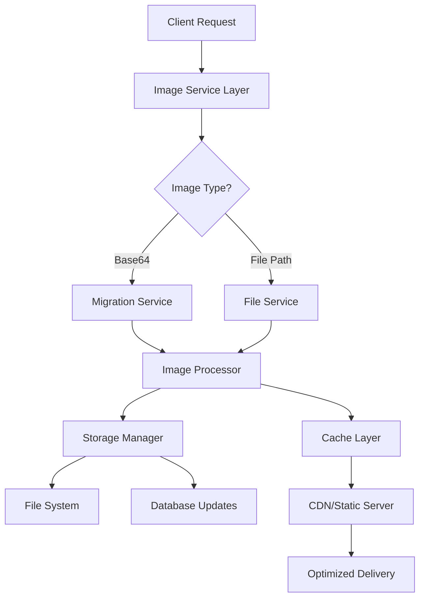

# Design Document

## Overview

This design outlines a comprehensive image optimization system for the Alibobo project that migrates Base64 encoded images to file-based storage, implements advanced image processing capabilities, and provides optimized delivery mechanisms. The system focuses on performance, scalability, and user experience improvements.

## Architecture

### High-Level Architecture



### System Components

1. **Migration Service**: Handles Base64 to file conversion
2. **Image Processor**: Handles compression, resizing, format conversion
3. **Storage Manager**: Manages file operations and database updates
4. **Cache Layer**: Implements intelligent caching strategies
5. **Delivery Service**: Optimized image serving with lazy loading

## Components and Interfaces

### 1. Migration Service

**Purpose**: Convert existing Base64 images to file system storage

**Key Classes**:
```javascript
class ImageMigrationService {
  async migrateBase64ToFiles(batchSize = 50)
  async convertBase64ToFile(base64Data, productId, imageIndex)
  async updateDatabaseReferences(productId, oldPath, newPath)
  async createRollbackPoint()
  async rollbackMigration(rollbackId)
}
```

**Migration Strategy**:
- Process images in batches to avoid memory issues
- Generate unique filenames using UUID + timestamp
- Maintain rollback capability
- Update database atomically
- Preserve original image quality during conversion

### 2. Image Processing Service

**Purpose**: Optimize images for web delivery

**Key Classes**:
```javascript
class ImageProcessingService {
  async processImage(inputPath, options = {})
  async generateMultipleSizes(imagePath, sizes = ['thumbnail', 'medium', 'large'])
  async convertToModernFormats(imagePath, formats = ['webp', 'avif'])
  async compressImage(imagePath, quality = 80)
  async generatePlaceholder(imagePath, blurRadius = 10)
}
```

**Processing Pipeline**:
1. **Input Validation**: Check file type, size, dimensions
2. **Size Generation**: Create thumbnail (150x150), medium (400x400), large (800x800)
3. **Format Conversion**: Generate WebP and AVIF versions with JPEG fallback
4. **Compression**: Apply optimal compression based on image content
5. **Placeholder Generation**: Create blur placeholders for lazy loading

### 3. Storage Management

**Purpose**: Handle file operations and database synchronization

**Directory Structure**:
```
uploads/
├── products/
│   ├── original/
│   │   └── {productId}/
│   │       ├── {imageId}.jpg
│   │       └── {imageId}.png
│   ├── thumbnails/
│   │   └── {productId}/
│   │       ├── {imageId}_thumb.webp
│   │       └── {imageId}_thumb.jpg
│   ├── medium/
│   │   └── {productId}/
│   │       ├── {imageId}_med.webp
│   │       └── {imageId}_med.jpg
│   └── large/
│       └── {productId}/
│           ├── {imageId}_lg.webp
│           └── {imageId}_lg.jpg
└── temp/
    └── migration/
```

### 4. Enhanced OptimizedImage Component

**Purpose**: Intelligent image loading with modern features

**Key Features**:
- **Progressive Loading**: Load images as they enter viewport
- **Format Selection**: Automatically serve best supported format
- **Size Selection**: Choose appropriate size based on container
- **Error Handling**: Graceful fallbacks and retry mechanisms
- **Performance Monitoring**: Track loading times and success rates

```javascript
const OptimizedImage = ({
  src,
  sizes = "thumbnail|medium|large",
  formats = ["webp", "avif", "jpg"],
  lazyLoad = true,
  placeholder = "blur",
  quality = 80,
  ...props
}) => {
  // Implementation with modern image loading strategies
}
```

### 5. Lazy Loading System

**Purpose**: Optimize initial page load and bandwidth usage

**Implementation Strategy**:
- **Intersection Observer**: Detect when images enter viewport
- **Progressive Enhancement**: Load higher quality versions progressively
- **Preloading**: Intelligently preload likely-to-be-viewed images
- **Bandwidth Adaptation**: Adjust quality based on connection speed

## Data Models

### Updated Product Schema

```javascript
// Enhanced image fields in Product model
const productSchema = new mongoose.Schema({
  // ... existing fields
  
  // Enhanced image handling
  images: [{
    id: { type: String, required: true }, // Unique image identifier
    originalPath: { type: String }, // Path to original file
    sizes: {
      thumbnail: { type: String }, // 150x150
      medium: { type: String },    // 400x400
      large: { type: String }      // 800x800
    },
    formats: {
      webp: {
        thumbnail: String,
        medium: String,
        large: String
      },
      avif: {
        thumbnail: String,
        medium: String,
        large: String
      },
      jpg: {
        thumbnail: String,
        medium: String,
        large: String
      }
    },
    metadata: {
      width: Number,
      height: Number,
      fileSize: Number,
      mimeType: String,
      uploadedAt: { type: Date, default: Date.now },
      processedAt: Date
    },
    // Legacy support
    base64Data: String, // Deprecated, will be removed after migration
    isProcessed: { type: Boolean, default: false }
  }],
  
  // Migration tracking
  migrationStatus: {
    type: String,
    enum: ['pending', 'in_progress', 'completed', 'failed'],
    default: 'pending'
  },
  migratedAt: Date
});
```

### Migration Log Schema

```javascript
const migrationLogSchema = new mongoose.Schema({
  batchId: { type: String, required: true },
  productId: { type: mongoose.Schema.Types.ObjectId, ref: 'Product' },
  imageIndex: Number,
  status: {
    type: String,
    enum: ['success', 'failed', 'skipped'],
    required: true
  },
  originalSize: Number, // Base64 data size
  newSize: Number,      // File size
  newPath: String,
  errorMessage: String,
  processingTime: Number, // milliseconds
  createdAt: { type: Date, default: Date.now }
});
```

## Error Handling

### Migration Error Handling

1. **Batch Processing**: Process images in small batches to prevent memory overflow
2. **Atomic Operations**: Use database transactions for consistency
3. **Rollback Mechanism**: Maintain ability to revert changes
4. **Error Logging**: Comprehensive logging for debugging
5. **Graceful Degradation**: Continue processing other images if one fails

### Runtime Error Handling

1. **Image Loading Failures**: Automatic fallback to default images
2. **Format Support**: Progressive enhancement with format detection
3. **Network Issues**: Retry mechanisms with exponential backoff
4. **Cache Invalidation**: Smart cache management for updated images

## Testing Strategy

### Unit Tests

1. **Migration Service Tests**:
   - Base64 to file conversion accuracy
   - Database update consistency
   - Rollback functionality
   - Error handling scenarios

2. **Image Processing Tests**:
   - Size generation accuracy
   - Format conversion quality
   - Compression effectiveness
   - Placeholder generation

3. **Component Tests**:
   - OptimizedImage loading behavior
   - Lazy loading functionality
   - Error state handling
   - Performance metrics

### Integration Tests

1. **End-to-End Migration**:
   - Complete migration workflow
   - Database consistency checks
   - File system verification
   - Performance benchmarks

2. **Image Delivery Tests**:
   - Format selection logic
   - Size selection accuracy
   - Cache behavior
   - Loading performance

### Performance Tests

1. **Migration Performance**:
   - Batch processing efficiency
   - Memory usage monitoring
   - Database performance impact
   - File system I/O optimization

2. **Runtime Performance**:
   - Image loading speed
   - Lazy loading effectiveness
   - Cache hit rates
   - Bandwidth usage optimization

## Implementation Phases

### Phase 1: Migration Foundation
- Set up migration service infrastructure
- Implement Base64 to file conversion
- Create rollback mechanisms
- Basic error handling and logging

### Phase 2: Image Processing
- Implement multi-size generation
- Add format conversion (WebP, AVIF)
- Optimize compression algorithms
- Generate blur placeholders

### Phase 3: Enhanced Delivery
- Upgrade OptimizedImage component
- Implement intelligent lazy loading
- Add format and size selection
- Performance monitoring

### Phase 4: Advanced Features
- Implement admin management tools
- Add storage analytics
- Optimize caching strategies
- Performance fine-tuning

## Security Considerations

1. **File Upload Security**:
   - Validate file types and sizes
   - Sanitize file names
   - Prevent directory traversal
   - Implement rate limiting

2. **Access Control**:
   - Secure file serving endpoints
   - Implement proper CORS headers
   - Add authentication for admin features
   - Monitor for suspicious activity

3. **Data Integrity**:
   - Verify file integrity after migration
   - Implement checksums for validation
   - Regular backup procedures
   - Audit trail for changes

## Performance Optimizations

1. **Caching Strategy**:
   - Browser caching with proper headers
   - CDN integration for global delivery
   - In-memory caching for frequently accessed images
   - Smart cache invalidation

2. **Delivery Optimization**:
   - Responsive image serving
   - Progressive JPEG encoding
   - HTTP/2 server push for critical images
   - Bandwidth-aware quality adjustment

3. **Storage Optimization**:
   - Efficient file organization
   - Automated cleanup of unused files
   - Compression at rest
   - Regular storage analytics